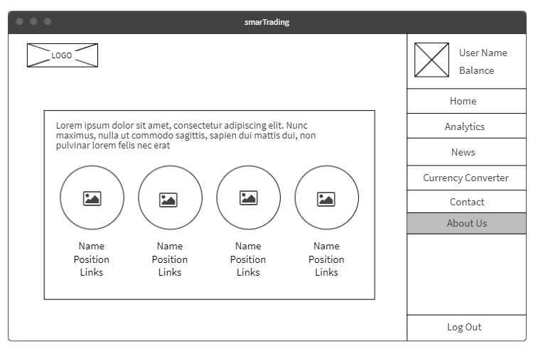

# 301 Final Project

## smarTrading 

## Overview
This project is an online library, where you can find books based on a title or author name.


### Authors:
Afnan Damra - Ayoub Kandah - Hamza Shamoun - Yazan Eyad

### Deployed Site:
[Link](https://smartrading-wsw.herokuapp.com/)

### Architecture
- EJS - CSS - JavaScript fore the front-end
- Node.js and Express.js for the back-end. 
- Postgresql for the DataBase


### Getting Started:
#### **APIs used:**
- [Stocks](https://finnhub.io/)
- [News](https://newsapi.org/)
- [Currency Converter](https://currency.getgeoapi.com/)

#### **Cloning:**
if you want to clone the project make sure to install required libraries

```console
$ npm i express cors superagent ejs dotenv pg method-override
```

## Wireframes:
#### Home

#### Sign Up

#### Analytics

#### News

#### Currency Converter

#### Contact

#### About


### User Stories:
1. As a user, I need to have a profile so that I can keep track of my balance.
2. As a user, I want to keep track of the stock market.
3. As a user, I want the data to update without having to refresh the page.
4. As a user, I want to see the stock market news so that I can have an up to date information and know how to spend my money.
5. As a user, I want the ability to convert the currency so that I can convert the currency easily.


## Credits and Collaborations:
- [Form styling](https://codepen.io/marcobiedermann/pen/Fybpf)
- [Styling](https://codepen.io/sylvmrtn/pen/zvvrXv)